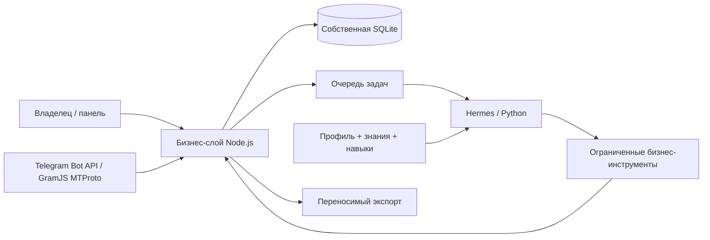

# HARNES2 — ИИ Генерация Лидов в MLM

Локальный проект постоянного ИИ-партнёра: собственные цель, контакты, задачи, память и навыки; Hermes выполняет цикл рассуждений и вызовов инструментов. Первый рабочий контур — рекрутинг PM International через диалоги и предложения следующих действий.

Архитектура реализована и зависимости установлены. Рабочий runtime по умолчанию выключен. Офлайн-бенчмарк Conversation Brain запускался отдельно на настроенной модели; он не включает Telegram и не изменяет бизнес-БД. Последний выборочный прогон v2 lean profile завершил 6 сценариев, ещё 2 сценария упёрлись в worker timeout.

## Запуск

Дважды нажмите `START-PARTNER.bat`: откроется панель **http://127.0.0.1:8790**. Сервер работает в фоне; закрытие вкладки его не останавливает. Для остановки — `STOP-PARTNER.bat`. Автозапуск при входе в Windows не добавлен.

Или в PowerShell из папки проекта:

```powershell
npm start
```

Ручной режим уже реализован: контакты с источниками, запись сообщений, черновики и версии, решения владельца, задачи, подтверждённые результаты, факты, уроки и версии инструкций. База создаётся при первом запуске без вымышленных контактов. Пока ИИ выключен, задачи остаются в очереди.

## Подключение модели позже

В `.env` задаётся `PARTNER_MODEL_API_KEY`; необязательные `PARTNER_MODEL_API_KEY_SECONDARY` и `PARTNER_MODEL_API_KEY_TERTIARY` используются по порядку как same-provider failover только после классифицированной ошибки ключа. Ротации между здоровыми ключами нет, состояние пула живёт только в одном процессе и не сохраняется в Hermes `auth.json`. Настройки находятся в `config/local.json`; образец — `config/local.example.json`. Для совместимого endpoint заполните `runtime.baseUrl` и `runtime.model`, оставьте `provider: "custom"`, `apiMode: "chat_completions"`, затем установите `runtime.enabled: true` и перезапустите сервер. URL должен включать нужный провайдеру API-путь, например `/v1`; конкретного провайдера этот проект пока не проверял.

Тарифы `inputUsdPerMillion` и `outputUsdPerMillion` задаются по вашей модели. Если стоимость запуска неизвестна, при включённом дневном пороге очередь приостанавливается. Дневной порог — ограничение по уже учтённым оценкам; текущий запуск может его превысить, это не жёсткий лимит биллинга. Сутки расходов считаются по UTC. Неизвестная стоимость не считается нулевой.

## Офлайн-бенчмарк разговоров

После явного включения runtime и наличия ключа запускается `npm run benchmark:conversation`. Команда использует текущие `provider` и `model`, проводит 20 разговорных сценариев, сохраняет полный raw-отчёт в `data/benchmarks/` и подменяет effect tools безопасными заглушками. Перед запуском команда требует выключенный Telegram; отправка и записи в бизнес-БД не выполняются.

Планировщик работает, пока запущен сервер: выполняет сохранённые задачи по сроку. `scheduler.dailyPlanning: true` добавляет ежедневное планирование по `timezone` и `planningHour`. Предложенные агентом новые задачи сначала рассматриваются владельцем.

## Opportunity Projection v0

[Opportunity Projection v0](docs/OPPORTUNITY_PROJECTION_V0.md) — read-only расширение настоящего Situation Router: разрешённый public snapshot и active offer дают гипотезу с evidence, unknowns и решением Router за один turn. Frozen v1 не изменён; отправка, сбор данных и отдельное хранилище не добавлены.

## Telegram

Поддерживаются два транспорта: `telegram.transport: "bot_api"` и `telegram.transport: "mtproto"`. Bot API использует `PARTNER_TELEGRAM_BOT_TOKEN`. MTProto использует GramJS (`telegram`/`TelegramClient`) и `PARTNER_TELEGRAM_API_ID`, `PARTNER_TELEGRAM_API_HASH` плюс `PARTNER_TELEGRAM_SESSION` или `PARTNER_TELEGRAM_SESSION_FILE`. В обоих режимах нужны числовые chat ID в `telegram.allowedChatIds` и `telegram.enabled: true`.

MTProto принимает только входящие личные текстовые сообщения из разрешённого списка. Он не выполняет поиск чатов, массовую рассылку или первый контакт. Исходящая отправка остаётся отдельно защищена `telegram.liveSending`: владелец сначала одобряет конкретную версию черновика, затем нажимает отправку. Не запускайте тот же MTProto session одновременно из нескольких процессов.

`telegram.liveSending` отдельно разрешает фактическую отправку. Владелец сначала одобряет конкретную версию черновика, затем нажимает отправку. Изменение диалога отменяет актуальность одобрения. При неизвестном результате доставки автоматического повтора нет: требуется сверка. Просьба остановить контакт, ручной перехват и отмена задач сохраняются в базе.

Тестовая GramJS session из старого `D:\HARNES\lead-search` перенесена только в игнорируемую `data/secrets/telegram.session`; ключи подключений находятся в локальном `.env` и не входят в экспорт.

## Структура

| Путь | Назначение |
| --- | --- |
| `business/` | SQLite, команды и события, задачи, контекст, версии черновиков, расходы |
| `business/migrations/` | Версионированная схема с контрольными суммами |
| `adapters/hermes/` | Запуск закреплённой версии Hermes через отдельный Python-процесс |
| `adapters/mcp/` | MCP stdio, доступ к планированию и предложениям |
| `contracts/` | JSON Schema команд и инструментов |
| `partner/` | Профиль, идентичность, знания, исходные навыки и каталог способностей |
| `public/` | Русская локальная панель без внешних CDN |
| `runtime/hermes-agent/` | Полный исходный checkout Hermes с сокращённой Git-историей |
| `runtime/upstream.lock.json` | Закреплённые источник, ревизия и зависимости runtime |
| `data/partner.sqlite` | Собственные рабочие данные партнёра; создаются при старте |
| `data/runtime/` | Временные области Hermes, служебные PID и токены |
| `data/logs/` | Журнал фонового сервиса |
| `scripts/` | Установка, запуск, остановка, синтаксическая сборка, экспорт и импорт |

Схема взаимодействия:



Факты, подтверждённые результаты и уроки разделены. Локальный опыт разговора не передаётся другому контакту; общий опыт требует обезличивания и рассмотрения владельцем. Навыки сохраняются с версиями и контрольными суммами. Утверждение инструкций не устанавливает исполняемый код и не выдаёт новые права. Предложения browser/email/calendar/social доступны в каталоге как направления развития, их интеграции ещё не реализованы.

Материалы PM International добавляются в `partner/knowledge/pm-international.json`: проверяемые факты с источниками. Сейчас там перечень недостающих материалов; коммерческие и продуктовые сведения не выдуманы.

## Экспорт и восстановление

В панели есть экспорт. Через командную строку:

```powershell
npm run export
npm run import -- exports/partner-DATE.json exports/restore-new
```

Экспорт содержит все бизнес-таблицы, связи, историю, тексты навыков и файлы `partner/`, контрольные суммы и версию схемы. Секреты, настройки подключений, сессии, `.venv` и исходный runtime не включены. Экспорт содержит личные данные контактов — храните его соответственно.

Импорт создаёт **новую** папку, проверяет формат, контрольные суммы, колонки и связи. Активная база не заменяется. Для активации остановите сервис, сохраните текущие `data/` и `partner/` под резервными именами, скопируйте восстановленные `data/` и `partner/` в корень проекта, проверьте соответствие `config/default.json → partnerId` восстановленному профилю, затем запустите сервис. Секреты и подключения задаются отдельно. Не копируйте один `.sqlite` из работающего приложения: используйте экспорт, поскольку база работает в WAL-режиме.

## Повторная установка и сборка

Нужны Node.js 24+, Git и uv. `npm run setup` устанавливает Node-зависимости по `package-lock.json`, получает закреплённый Hermes и устанавливает Python-зависимости по upstream `uv.lock`. Имеющиеся `.env` и `config/local.json` сохраняются.

`npm run build` проверяет синтаксис собственного JavaScript, JSON и Python без импорта приложения, создания тестовых данных и запросов к модели. Тестовой команды нет. Сценарии с моделью, Telegram, восстановлением и интерфейсом ещё предстоит проверять отдельно после разрешения владельца.

MCP запускается командой `npm run mcp` при работающем локальном сервере. Для MCP-клиента предпочтительно указать напрямую абсолютный путь к `.venv/Scripts/python.exe` и аргумент `adapters/mcp/server.py` с абсолютным путём. Адаптер получает отдельный служебный токен и не может одобрять или отправлять сообщения.

Подробное обоснование решений — `DIGITAL_AI_PARTNER_ARCHITECTURE.md`. Фактический состав поставки и ограничения — `IMPLEMENTATION_STATUS.md`. Лицензии — `THIRD_PARTY_NOTICES.md`.
