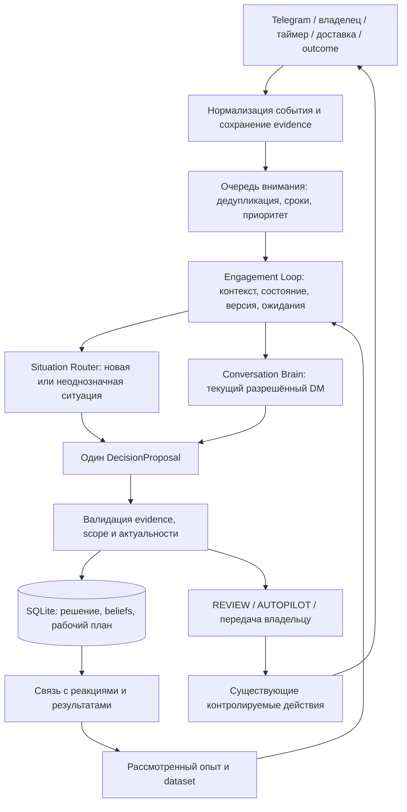

> Реалізація Persistent Engagement v1: див. [канонічну модель](PERSISTENT_ENGAGEMENT.md), [інтеграцію](PERSISTENT_ENGAGEMENT_HANDOFF.md) і [межі перевірок](PERSISTENT_ENGAGEMENT_VALIDATION.md). Цей документ збережено як історичний review, а не другу незалежну специфікацію runtime.

# HARNES2: cognitive loop над Situation Router

Дата: 11 сентября 2026. Основание: статическое чтение checkout `85547ef5c2c401ebdf653ddc255b2a512282c24b`, существующих контрактов, бизнес-слоя, профиля и сохранённых отчётов. Рабочее дерево до review было чистым.

Это проектное решение для следующей итерации. Код, БД, настройки и работающие процессы не изменялись; тесты, benchmark и вызовы моделей не выполнялись. Упоминания предыдущих прогонов ниже взяты из сохранённых отчётов и не являются результатом нового прогона.

## 1. Рекомендация

Добавить **сохраняемый контур ведения взаимодействия — Engagement Loop**. Он хранит рабочую цель, текущие гипотезы, историю решений и условия пересмотра. Situation Router и Conversation Brain остаются исполнителями рассуждения внутри этого контура; Hermes остаётся runtime, SQLite — источником бизнес-состояния.

На ближайшей итерации нужен один новый уровень над Router. Второй уровень — распределение внимания между взаимодействиями — сначала реализовать обычной очередью и существующим ежедневным планированием. Отдельный LLM Opportunity Planner, который заново думает перед каждым сообщением, пока не нужен.

Решения:

1. **Opportunity и Engagement нужны как предметные понятия; отдельные агенты для них — нет.** Opportunity — гипотеза о возможности помочь в конкретной ситуации. Engagement — сохраняемая работа с этой возможностью, включая решение не продолжать.
2. **Одно решение о следующем ходе на один актуальный контекст.** Не запускать Planner, Router и Brain как три независимых органа, каждый из которых заново выбирает канал и стратегию.
3. **Хранить beliefs отдельно от facts.** Рабочая гипотеза может обновляться автоматически с источниками; это не подтверждённый факт, разрешение на контакт или бизнес-результат.
4. **Планировать ближайшее полезное действие и условия пересмотра.** Не будущие реплики собеседника и не обязательные стадии продажи.
5. **Записывать решения и ожидания до действия, результаты — после фактических событий.** Иначе база разговоров не станет пригодным decision dataset.
6. **Сначала доказать пользу состояния и обратной связи.** Дополнительные модели, графы памяти и автономное обучение добавлять только под наблюдаемую проблему.

Принцип минимальной сложности соответствует инженерным рекомендациям Anthropic: дополнительные агентные шаги имеют цену в задержке и расходах, а усложнение должно оправдываться результатом. Здесь это поддержка выбора, а не основание менять Hermes или переносить проект на другой framework. [Building effective agents](https://www.anthropic.com/engineering/building-effective-agents).

## 2. Что уже есть и что действительно отсутствует

| Слой | Фактическое состояние | Решение review |
| --- | --- | --- |
| Persistent partner | Профиль, цель, знания и навыки в `partner/`, данные в SQLite | Сохранить |
| Conversation Brain | Поведение реализовано через `context.mjs`, identity, examples, recruiting skill и Hermes tools; отдельного сервиса Brain нет | Сохранить; добавить общий результат решения и состояние взаимодействия |
| Situation Router | Изолированный proposal-only эксперимент: схема, нормализация, Python worker, fixtures и benchmark; не включён в рабочий scheduler | Не считать уже работающим источником production-действий |
| REVIEW / AUTOPILOT | Режим разговора, автоматические одобрения и доставка через существующие проверки | Сохранить разделение решения и полномочий |
| Telegram | Bot API и GramJS MTProto; оба входящих обработчика ограничены личными сообщениями | Публичный snapshot пока проектировать отдельным входом; не обещать готовый групповой ingest |
| Facts / lessons / outcomes | Есть отдельные таблицы, источники, рассмотрение владельцем | Развить связи с решениями, не сливать в общую «память» |
| Current belief / working plan | Нет канонической модели. Есть `persons.notes`, `conversations.stage`, задачи и контекст запуска | Здесь основной новый слой |
| Learning / attribution | Есть версии текстов, расходы и события, но нет единой связи от возможности до решения, вмешательства человека и позднего результата | Добавить идентификаторы и dataset projection |

Опорные места: `business/context.mjs:16`, `business/service.mjs:111`, `business/service.mjs:313`, `business/scheduler.mjs:21`, `business/channels/telegram.mjs:33`, `business/channels/telegram-mtproto.mjs:79`, `business/migrations/001-core.sql:1`, `business/migrations/002-conversation-mode.sql:1`.

### Замечания, которые влияют на следующий слой

**A. До оценки модели исправить передачу схемы.** В `business/situation-router.mjs:8` компилируются `schema.$defs.input` и `schema.$defs.output` отдельно. Их `$ref` указывают на `#/$defs/...`, но корневые `$defs` при этом потеряны. По статическому чтению это дефект разрешения ссылок при компиляции AJV, а не проблема качества LLM. Исправление: регистрировать целую схему с `$id` и компилировать ссылку на нужный definition либо передавать wrapper с полными `$defs` и корневым `$ref`. В этом review модуль не импортировался, ошибка выполнением не воспроизводилась. `npm run build` проверяет синтаксис, а не компиляцию схем AJV.

**B. Модель должна видеть выходной контракт.** `buildRouterContext` (`business/situation-router.mjs:105`) передаёт инструкции, метку `situation-router-v1` и input. Benchmark (`scripts/situation-router-benchmark.mjs:81`) и worker (`scripts/situation_router_worker.py:54`) не добавляют описание output schema. Название контракта не сообщает модели обязательные поля, вложенные объекты и допустимые значения. Передавать компактную полную форму output и ограничения, в том числе режим без draft для WAIT/HANDOFF. У worker также загружается общая identity (`:25`, `:50`), содержащая инструкции о business tools; согласовать её с no-tool задачей Router.

**C. Структурная валидация ещё не проверяет допустимость хода.** `validateSituationOutput` (`business/situation-router.mjs:114`) проверяет ID evidence и согласованность decision/draft.channel, но не принадлежность `target_id` доступному адресату и не соответствие `goal.allowed_channels`. Строка `no_cold_outreach: true` в prompt не является проверкой разрешения на конкретный DM. До подключения исполнения нужен код, вычисляющий разрешённые действия и цели по текущему бизнес-состоянию. Сейчас Router ничего не отправляет, поэтому это блокер интеграции, а не утверждение об уже произошедшей отправке.

**D. Snapshot слишком тесно связан с последней входящей репликой.** `normalizeSituationInput` (`business/situation-router.mjs:63`) требует последнего входящего сообщения, а ссылки facts и reply — внутри последних N сообщений. Это мешает таймеру, результату доставки, подтверждению владельца и факту из более раннего разговора. Нужны отдельный trigger и разрешённый набор evidence, который может включать старые источники. Дополнительно текущая `message` должна совпадать с соответствующим элементом snapshot по содержимому, автору и времени, а не только ID. Внешний reply-parent может быть известной ссылкой с отсутствующим содержимым; не нужно выдумывать его или считать весь snapshot недействительным.

**E. Персональный разговор нельзя использовать как контейнер группы.** `conversations` принадлежит одному `person_id`; у `messages.author` нет самостоятельной модели многих Telegram-участников. Для публичного наблюдения сохранять chat/thread/author отдельно. Не приписывать всю дискуссию последнему автору и не создавать каждому замеченному участнику CRM-карточку.

**F. Сейчас событие уже предрешает работу «ответить».** `message.record` создаёт `kind: reply` на каждое подходящее входящее (`business/service.mjs:127`). Это полезный текущий механизм, но новый контур должен ставить задачу «оценить актуальную ситуацию». Несколько входящих подряд объединять в один decision turn по последнему контексту. `tasks.done` после успешного runtime (`business/scheduler.mjs:52`) означает завершение вычисления, а не завершение взаимодействия.

**G. Отчёт о шести ходах показывает локальные симптомы отсутствия состояния.** В сохранённом review отмечены повторное выяснение уже выраженного интереса и преждевременное «время подходит». Это аргумент за явные answered questions, current objective и pending commitments. Но `6/6 completed` не доказывает эффективность продаж: fixture заранее задаёт дальнейшие входящие реплики. Источник: `docs/benchmarks/2026-09-11-conversation-brain-multiturn.md` и `benchmarks/conversation-brain-multiturn.fixture.json`.

## 3. Минимальная архитектура: один основной и один лёгкий верхний уровень



Это логические обязанности, не предложение создать восемь сервисов. Для следующего increment достаточно добавить координацию и сохранение состояния в `business/`, расширить контракты и использовать уже имеющиеся scheduler/service/tools.

| Обязанность | Реализация сейчас | Отдельный LLM-модуль? |
| --- | --- | --- |
| Наблюдение, идентичность источников, очередь | Каналы + SQLite + scheduler | Нет |
| Сбор актуального состояния и доступных свидетельств | Расширение `context.mjs` | Нет; краткую интерпретацию обновляет тот же decision turn |
| Определение возможности, обновление гипотез, выбор цели | Контекст и structured result Router/Brain | Совместно с выбором следующего хода |
| Выбор канала, стратегии, текста | Router для новой ситуации, Brain для активного DM | Уже имеющиеся способности |
| Исполнение, ожидание, перехват | Service + tasks + transport | Нет |
| Разбор результата и предложение урока | Отложенная review-задача | Редкий отдельный запуск при наличии результата |

Не делать отдельные Emotion Engine, Persona Scorer, Intent Agent, Channel Agent и Strategy Agent. Они будут независимо интерпретировать одни данные, увеличивать задержку и закреплять ошибки друг друга.

## 4. Нужен ли Opportunity / Engagement Planner

**Нужна функция планирования, но пока не отдельный постоянно вызываемый агент.**

Для новой ситуации Router в одном рассуждении определяет: есть ли полезная возможность, что человек действительно сообщил, что неизвестно, уместно ли вмешаться, какой ход лучше бездействия. Opportunity, канал и стратегия связаны; не нужно заставлять три модели выбирать их последовательно без возможности пересмотра.

Для существующего DM Brain получает текущее engagement state и возвращает следующий ход вместе с его изменениями. Вызов Router перед каждой обычной репликой DM создаст лишнюю конкуренцию решений. Brain может вернуть WAIT, HANDOFF или отсутствие ответа, если это уместно; наличие активного DM не обязывает отвечать на любое «ок».

При переходе public → DM допустимы два варианта без двойного решения:

- Router уже вернул пригодный draft: использовать его после проверок.
- Router вернул согласованный intent, а нужен более подробный DM-текст: Brain выступает только как composer под этим intent. Если intent противоречит контексту, вернуть `needs_replan`, а не молча менять адресата, разрешения или обещания.

Один decision turn — один логический запуск рассуждения. Hermes внутри может сделать несколько API/tool вызовов; обещать строго один API-запрос неправильно. Не добавлять отдельные extraction, scoring, planning и critique-запуски на каждое сообщение.

Если для выбора не хватает решающего контекста, дать тому же Router/Brain возможность запросить **ограниченное дополнительное чтение**: родительскую реплику, относящиеся к теме прошлые сообщения, разрешённый источник knowledge или существующее подтверждение владельца. Это внутреннее действие рассуждения, не новый публичный decision enum. В первой интеграционной версии достаточно одной дополнительной порции контекста с бюджетом; если её нет, вернуть WAIT/HANDOFF с конкретной информационной причиной. Не создавать задачу «исследовать человека целиком» и не вызывать отдельного Research Agent перед каждым ответом.

Рабочий план содержит:

- **Зачем продолжать:** полезная для человека задача и связь с целью партнёра; отсутствие такой связи — нормальный вывод.
- **Ближайшая цель:** какой вопрос решить сейчас, что уже было объяснено.
- **Текущая гипотеза:** почему этот ход может быть уместен; какое объяснение ситуации остаётся альтернативным.
- **Следующее действие:** или сознательное отсутствие действия.
- **Ожидаемый наблюдаемый сигнал:** что мы сможем увидеть после действия.
- **Условие пересмотра/закрытия:** новые данные, срок договорённости, вмешательство владельца, отказ.

Не хранить план «вопрос 1 → возражение → прогрев → созвон». Направления `answer/clarify/advance` остаются описательными метками, а не обязательными состояниями.

Отдельный верхний Opportunity Planner станет оправданным, когда одновременно будет больше релевантных возможностей, чем бюджет времени/модели/владельца, и обычная очередь начнёт регулярно выбирать менее полезную работу. Тогда он периодически распределяет внимание между engagements. Он не пишет клиентам и не перепланирует каждый диалог. Пока использовать сроки обязательств, незавершённые входящие, ручной приоритет и существующее daily planning; веса «вероятности продажи» из головы не вводить.

## 5. Facts, beliefs, strategy и experience

| Вид знания | Что это | Где хранить | Как меняется |
| --- | --- | --- | --- |
| Observation | Произошло сообщение, доставка, правка, действие владельца | `messages`, `events`, `delivery_attempts`; для публичных источников — observations | Новое событие или новая версия; источник сохраняется |
| Fact / claim | Подтверждённое наблюдение или утверждение человека с типом источника | Существующие `facts` | Рассмотрение, уточнение, опровержение; история остаётся |
| Belief / inference | Рабочее объяснение: «пока интересуется продуктом, не партнёрством» | Отдельные `beliefs` | Автоматически предлагаемые изменения с evidence и областью применимости |
| Strategy / plan | Наше намерение: «ответить на вопрос об условиях, не звать на звонок сейчас» | `engagements.plan_json`, история в decisions | Пересмотр при изменении оснований |
| Experience | Условный вывод из нескольких решений/эпизодов и результатов | `lessons` + ссылки на decision/outcome | Кандидат → рассмотрен → активен → отозван/заменён |
| Business result | Состоявшаяся встреча, присоединение, отказ и т. п. | `outcome_events` | Только с внешним или операторским свидетельством |

Факт «человек написал, что у него есть опыт MLM» не тождественен независимо проверенному опыту. В fact нужны `claim_kind`/`verification_kind` и источник. `status=confirmed` означает рассмотрение записи; не магическое подтверждение истинности всех слов человека.

`notes` оставить заметками владельца. `stage` оставить удобной CRM-проекцией. Ни то ни другое не заменяет beliefs. `runs.context_json` — снимок прошлого запуска, а не единственное место текущего состояния.

### Область belief важнее единого lead score

Разделить **субъект утверждения** и **область, где его разрешено использовать**. Известное в личке о человеке не становится доступным для публичного ответа только из-за общего person ID.

- Person: явно сообщённые предпочтения и устойчивый релевантный контекст.
- Engagement: текущий вопрос, интерес к конкретному предложению, возражение, намерение продолжать.
- Chat/thread: тема разговора, участники, кому адресован вопрос, замеченные нормы общения. Правила модерации из проверенного источника отделены от предположений о настроении группы.

Хранить несколько объяснений при неоднозначности: «заинтересован в условиях» и «просто проверяет прозрачность». Не превращать «ищет работу» в «хочет MLM», интерес к продукту — в интерес к рекрутингу, а молчание — в отказ. Не строить психотип или оценку уязвимости человека.

Минимальная belief-запись: `id`, `subject_type/id`, `engagement_id?`, `scope`, `statement`, `evidence_refs`, `counterevidence_refs`, `confidence_label`, `status`, `observed_at`, `assessed_at`, `valid_until?`, `based_on_decision_id`, `supersedes_id?`.

`confidence_label` — субъективная оценка качества оснований, не измеренная вероятность. Текущий `confidence: 0..1` Router не использовать как процент вероятности покупки или основание AUTOPILOT. Противоречие переводит belief в disputed/superseded, а не бесследно переписывает прошлую версию. Истечение актуальности означает необходимость пересмотра, а не доказательство обратного.

## 6. Минимальное расширение SQLite

Предлагается **три новые таблицы для контура на существующих DM**, затем четвёртая для публичного наблюдения. Это проект схемы, не применённая миграция.

| Таблица | Минимальное содержание | Зачем отдельно |
| --- | --- | --- |
| `engagements` | `partner_id`, `person_id?`, `origin_ref`, `topic`, `active_conversation_id?`, `status`, `revision`, `plan_json`, `last_decision_id?`, `next_review_at?`, `close_reason?` | Работа над конкретной темой/возможностью переживает один turn и переход канала |
| `beliefs` | Версионированные утверждения, субъект, scope, evidence, актуальность | Автоматическое обновление не превращает inference в facts |
| `decisions` | `engagement_id?`, `run_id?`, trigger, snapshot/basis, решение, краткое обоснование, изменения belief/plan, expected observation, policy/prompt versions | Фиксация выбора до воздействия и независимость от runtime |
| `observations` — второй increment | Источник, chat/thread/author, external ID + версия, время события и получения, доступный текст/ссылка, provenance, scope | Публичная дискуссия с несколькими людьми не помещается в личный `conversation` |

В `decisions.engagement_id` допустим null: можно записать IGNORE без создания карточки «лида». Для интересного публичного вопроса engagement может сначала быть привязан к теме и source thread, без `person_id`. Продолжение в DM связывается после подтверждения identity.

У `engagements` операционные состояния вроде `open`, `waiting`, `human_owned`, `closed`, `expired`. Это жизненный цикл работы, а не стадии психологического «прогрева». Основание ожидания/закрытия — отдельное поле. `unknown_delivery` принадлежит доставке и блокирует повтор, а не превращается в отрицательный интерес.

У одного человека возможны разные темы и engagements. Для первой версии не нужен общий граф отношений: текущий DM может иметь один активный engagement по теме, история связывается через решения. Публичный источник остаётся в `origin_ref`; переход в DM не стирает его.

Связи добавлять nullable-колонками к существующим tasks/runs/drafts/outcomes: `engagement_id`, `decision_id` там, где они применимы. `decision_id` в draft не заменяет `run_id`; первый означает бизнес-выбор, второй — конкретное вычисление. Повтор runtime может относиться к тому же незавершённому решению. Версии текста, approvals и delivery_attempts продолжают существовать отдельно.

Для obligations, плановых ожиданий и handoff на этой стадии использовать `plan_json` + типизированные tasks/events. Отдельные Promise Engine, Wait Service и Handoff Database пока не нужны. Индексировать поля, по которым работает очередь: status, due/next_review, engagement/person scope. Произвольный JSON не использовать вместо ключей и ссылочной целостности.

Public observations не обязаны дублировать все личные сообщения: DM evidence ссылается на `messages`, публичное — на `observations`, операторское — на `events`. Нужен небольшой типизированный resolver evidence, не новая универсальная система документов.

Идентификацию связывать по устойчивым ID платформы и подтверждённым связям. Совпадение имени, username или догадка модели не объединяют людей. Бот, собственный аккаунт, реальный участник и неизвестный автор должны различаться, иначе собственная активность начнёт выглядеть как спрос.

Миграции добавлять после `002`, старые не редактировать. Обязательно расширить `Store.TABLES`, export/import, версии bundle, правила удаления/редактирования и восстановление связей. Сейчас importer ожидает точное совпадение таблиц и миграций (`scripts/import.mjs:15`); изменение схемы без миграции старого bundle нарушит переносимость партнёра.

## 7. End-to-end loop

1. **Observe.** Сохранить реальное событие с source ID, author/chat/thread, `occurred_at` и `observed_at`. Сохранить правки/удаления как изменения источника. Пропуск синхронизации помечать: отсутствие увиденного сообщения не всегда означает отсутствие реакции.
2. **Select attention.** Код убирает дубликаты, объединяет пакет соседних сообщений одного interaction scope, учитывает режимы, сроки и бюджет. Очередь выбирает контекст для рассмотрения, а не готовый продажный ответ. Первые вопросы и обязательства не должны голодать из-за потока общих событий.
3. **Build context.** Собрать текущий вопрос, reply-chain, участников, проверенные сведения, scoped beliefs, план, уже данные ответы, незавершённые обязательства, прошлый фактический исходящий и доступные действия. Добавить несколько релевантных рассмотренных уроков. Не передавать всю CRM и все внутренние заметки.
4. **Identify / understand / choose.** В одном decision turn LLM определяет полезность вмешательства и ближайшую цель, обновляет объяснение ситуации, совместно выбирает канал и стратегию. Публичная возможность может быть вопросом для всей группы; не обязательно выбрать «лида».
5. **Ground and validate.** Код проверяет схему, существование и доступность evidence, адресата, allowed actions, объём вывода и актуальность basis. Наличие настоящего evidence ID не доказывает, что оно поддерживает утверждение: entailment проверяется оценкой модели/человека при разборе, а не одной проверкой ID.
6. **Commit decision.** В одной транзакции записать decision, допустимые изменения beliefs/plan и proposal. Изменения состояния относятся к восприятию текущих фактов; предсказанные реакции не добавлять в состояние как произошедшие. При конфликте версии сохранить stale decision для диагностики, но не применять его patch или draft.
7. **Act under authority.** REVIEW ждёт решения владельца; AUTOPILOT применим только в отдельно разрешённой области. Перед любым эффектом заново проверить scope, suppression, ownership, mode, live sending и версии. Выбор DM моделью сам не создаёт разрешение на новый контакт.
8. **Record actual execution.** Сохранить фактически отправленную версию, редактора, authority, transport receipt и результат. Отказ владельца, изменение текста и неизвестная доставка — разные события, ни одно не является реакцией клиента.
9. **Observe reaction.** После подтверждённого действия ждать новый наблюдаемый сигнал. Только теперь начинается окно реакции на сообщение. Неизвестная доставка требует сверки, а не повторного «напоминания».
10. **Update and reconsider.** Новое сообщение, подтверждение владельца, срок обязательства или значимый внешний факт создаёт новый trigger. Пересмотреть belief и ближайшую цель; смена стратегии допустима в любой момент при изменении оснований. Если ничего нового не произошло и срок не наступил — новый LLM-запуск не нужен.
11. **Handoff / close.** Передать владельцу работу с контекстом и требуемым решением или завершить engagement. Не держать бессрочные follow-up ради активности. Отказ может означать правильное завершение, хотя продажи нет.
12. **Learn.** Когда появились реакция/исход и достаточно наблюдений, собрать episode, предложить условный урок, отдельно рассмотреть его применимость. Урок влияет на будущие решения через scoped retrieval, не через автоматическое переписывание identity.

### WAIT, IGNORE и HANDOFF должны иметь исполняемую семантику

- **IGNORE:** не действовать по этому trigger. Сохраняется причина; новый существенно отличающийся сигнал может открыть другое решение. Это не вечная блокировка человека. Для окончательного прекращения отдельно меняется lifecycle/suppression с основанием.
- **WAIT:** хранить, чего ждём: `new_relevant_event`, `owner_confirmation`, `delivery_reconciliation` или `review_at`. `review_at` означает повторную оценку, не автоматическую отправку. Нужны ограничение числа бессодержательных пересмотров и срок жизни возможности. Базовый таймер scheduler не должен заново платить за тот же snapshot каждые 20 секунд.
- **HANDOFF:** создать задачу владельцу, передать ownership, зафиксировать необходимые сведения, желаемое решение и срок. Сообщение человеку — отдельное необязательное действие. Сейчас handoff связан с draft (`business/service.mjs:336`); Router возвращает HANDOFF без draft, поэтому требуется адаптер бизнес-действия, а не выдуманное сообщение для технического срабатывания.

Handoff packet: кто и откуда, что спросил, что уже сообщили, актуальные факты/гипотезы с разделением, что обещано, чего не хватает и какой ответ требуется от владельца. Нужны события `requested`, `accepted`, `resolved`/`returned`. Сам факт передачи владельцу не равен проведённому звонку. REVIEW — проверка proposal; HUMAN_OWNED — ответственность за продолжение. Эти понятия не смешивать.

### Защита от устаревшего решения

Basis решения включает event watermark, engagement revision, conversation revision, scope/authorization version и hash использованного knowledge/policy bundle. Работа модели идёт вне транзакции. Перед commit выполняется compare-and-swap по material basis; перед send — повторная проверка. Изменение собственным commit текущей revision известно системе и отражается в сохранённой post-commit basis.

Одобрение связывается с конкретным действием: текстом/версией, каналом, адресатом, reply target и basis. Старое одобрение DM не применимо к публичному тексту. Входящее во время генерации, ручной takeover, изменение разрешений и новый существенный факт отменяют применимость старого proposal. Не нужно переносить это в prompt: проверки принадлежат бизнес-коду.

## 8. Предлагаемый контракт следующего решения

Сохранить enum Router `IGNORE | WAIT | PUBLIC_REPLY | DM | HANDOFF`. Для следующей интеграционной версии обернуть его в общий decision envelope; не ослаблять замороженный offline v1 с его `never_send/review_required`.

**Input:** trigger и его тип, basis, engagement state, person/chat scopes, recent messages + необходимые ancestors, evidence bundle, available actions с причинами ограничений, версии знаний и релевантный опыт. `available_actions` рассчитывает код, а не LLM. Availability транспорта и социальная уместность — разные поля.

**Output, схематично:**

```json
{
  "engagement_id": "eng-example",
  "basis": { "engagement_revision": 7, "event_watermark": 108 },
  "decision": "WAIT",
  "objective": "Получить подтверждение владельца на предложенное время",
  "strategy": "Сохранить пожелание человека; не объявлять встречу назначенной",
  "reason": "Время предложено человеком, ответа владельца ещё нет",
  "evidence_refs": [{ "kind": "message", "id": "msg-example" }],
  "belief_changes": [
    {
      "operation": "upsert",
      "statement": "Человек хочет перейти к разговору с владельцем",
      "scope": "engagement",
      "confidence_label": "supported",
      "evidence_refs": [{ "kind": "message", "id": "msg-example" }]
    }
  ],
  "plan_patch": { "waiting_for": "owner_confirmation" },
  "expected_observation": "Владелец подтвердит время или предложит другое",
  "reconsider_on": ["owner_response", "new_relevant_message", "review_deadline"],
  "alternative_considered": "Ещё раз уточнять интерес не требуется: запрос на звонок уже есть",
  "draft": null
}
```

Это пример формы, не готовая JSON Schema и не обязательный ответ в аналогичной ситуации. На первом запросе созвона уместен HANDOFF; WAIT здесь описывает уже переданную владельцу задачу. Полную basis, дедлайны и конкретные owner/task refs задаёт интеграционный контракт.

Не просить модель раскрывать длинную внутреннюю цепочку рассуждений. Достаточно проверяемого decision summary: основания, неизвестное, выбранный ход, важная альтернатива и ожидание. `belief_changes` и `plan_patch` должны иметь allowlist полей; модель не может патчем изменять delivery, полномочия, confirmed facts или outcomes.

Draft target должен быть типизирован: transport account, chat, public thread/reply target либо подтверждённая DM identity. Абстрактного `target_id` недостаточно. Для публичного вывода builder не включает личные сведения человека, даже если их знает внутренний партнёр.

## 9. Пример цикла без sales script

Это синтетическая иллюстрация пересмотра состояния, не последовательность, которую надо проходить каждому человеку.

| Наблюдение | Что знаем / чего не знаем | Возможный ход | Что меняет следующее решение |
| --- | --- | --- | --- |
| В разрешённом публичном обсуждении спрашивают, как сравнивать условия партнёрских проектов | Есть вопрос о сравнении; интерес к нашему предложению неизвестен | PUBLIC_REPLY с полезными критериями, если есть основания ответить | Прямой вопрос, новая информация либо отсутствие продолжения |
| Человек отвечает: «А у вас какие условия?» | Интерес к конкретной информации; желание вступить неизвестно | Ответить доступными фактами в текущей ветке; пробелы обозначить по существу | Уточнение вопроса или запрос приватности |
| Человек сам начинает DM и просит детали | Есть входящий личный запрос по конкретной теме | Brain продолжает с сохранением публичного источника и отвеченных вопросов | Различение интереса к продукту/партнёрству, новые ограничения |
| «У меня был плохой опыт, но хочу понять условия» | Не отказ; есть одновременно осторожность и выраженный интерес | Ответить на предметный вопрос, без сброса к знакомству | Что именно человек уточнит дальше |
| «Сначала пришлите информацию, созвон не нужен» | Звонок сейчас не желателен | Сменить стратегию на предоставление проверенной информации | Явное возобновление интереса, а не таймер давления |
| Позже человек сам просит созвон и предлагает время | Есть запрос и предпочтительное время; доступность владельца неизвестна | HANDOFF; при необходимости отдельный короткий draft о проверке времени | Подтверждение владельца |
| Владелец подтверждает, сообщение фактически отправлено | Согласование состоялось в пределах подтверждённых данных | Записать соответствующее событие; ждать дальнейших фактов | Факт проведения/переноса/неявки |
| Встреча состоялась, человек решил не продолжать | Встреча — положительный процессный outcome; joining отсутствует | Закрыть тему, сохранить основание и разобрать точность ожиданий | Новая инициатива человека, если она появится |

Ни на одном шаге число сообщений не определяет степень готовности. Личная тема, смена намерения или отказ меняют план сразу. Ранняя польза может состоять в честном выяснении неподходящего предложения, а не в максимизации числа созвонов.

## 10. Что делать кодом, что оставить LLM

| Задача | Код | LLM |
| --- | --- | --- |
| Очередь событий | ID, порядок, дедупликация, debounce, сроки, restart recovery | Семантическая значимость пакета |
| Кто говорит и куда можно писать | Подтверждённые platform IDs, scopes, transport capabilities, ACL | Кому по смыслу адресована реплика; не создание identity |
| Уместность возможности | Доступные области, лимиты внимания, известные запреты | Польза, релевантность, момент, альтернативные объяснения |
| Канал | Исполнимость и полномочия для конкретного адресата | Предпочтение среди допустимых вариантов |
| Стратегия | Формат proposal и запрет неподдерживаемых эффектов | Ближайшая цель, ответ/уточнение/отступление/передача |
| Факты и гипотезы | Разделение таблиц, источники, версии, scope | Извлечение claim, интерпретация, указание противоречия |
| Stop | Применение и сохранение suppression, отмена работы, запрет самовольного возобновления | Понимание естественной просьбы и её области |
| WAIT | Durable task/watch, срок, дедупликация и прекращение циклов | Что ждём и какой новый сигнал важен |
| REVIEW/AUTOPILOT | Проверка полномочий, версий и подтверждений в момент эффекта | Рекомендация действия, но не самовыдача полномочий |
| Learning | Точные связи, версии dataset, ограничения retrieval | Кандидат условного урока, разбор ошибок |
| Evaluation | Проверяемые инварианты, связность событий, стоимость и доставка | Семантическая оценка по rubric; не подтверждение реальной продажи |

Семантический stop не сводится к regex. Модель может предложить приостановить контакт со ссылкой на актуальное сообщение; код применяет уменьшение области действий. Возобновление или расширение прав требует соответствующего подтверждённого основания. Не давать модели редактировать permission обычным belief patch.

Не писать правила вида «упомянул заработок → DM», «два положительных ответа → звонок», «три дня молчит → напоминаем». Допустимы жёсткие правила над реальными фактами исполнения: «доставка неизвестна → не повторять», «время не подтверждено → не создавать booked», «разговор у человека → не отправлять автономно».

## 11. Как разговоры превращаются в decision dataset

Единица данных — **решение на доступной тогда информации**, связанное с фактически исполненным действием и последующими наблюдениями. Не просто пара «входящее → удачный ответ».

Минимальная запись dataset:

- ID эпизода, решения, человека/анонимного субъекта и области; источник возможности.
- Trigger, время события и получения, доступный на момент решения snapshot, версии beliefs/plan и knowledge/policy/skill/retrieval.
- Выбор Router/Brain, короткое обоснование, неизвестное, важная невыбранная альтернатива. У альтернативы **нет наблюдаемого outcome**, если она не исполнялась.
- Ожидаемый сигнал и окно наблюдения, записанные до действия.
- Исходный draft, правки и причины владельца, одобренная и фактически отправленная версии; кто выбрал стратегию и кто написал финальный текст.
- Доставка, связанная реакция, обновление состояния, подтверждённые outcomes, поздние исправления/отмена результата.
- Задержки модели, review и handoff; токены, известная/неизвестная стоимость, доступное время владельца.
- Источник происхождения данных: real, synthetic, replay, shadow; состояние наблюдаемости и завершённость окна результата.

Сохранять WAIT/IGNORE, ошибки, no-action, отказы владельца и неудачные outcomes. Иначе получится коллекция успешных примеров с selection bias. При большом публичном потоке допустимы агрегаты и воспроизводимая случайная выборка проигнорированных наблюдений; вероятность включения в выборку сохраняется. Это вероятность семплирования данных, не вероятность выбора действия моделью.

Срез для model input должен быть **point-in-time correct**: только то, что было доступно системе в момент выбора. Поздно полученное старое сообщение имеет ранний `occurred_at`, но поздний `observed_at`; его нельзя задним числом подкладывать в прошлый контекст. Поздние outcomes остаются targets/feedback, а не признаками входа. Нужны сохранённый effective input или восстанавливаемые версии его источников, не только текущие строки БД и их hashes.

### От episode к lesson

1. Связать decision → фактическое действие → наблюдения → результат и отметить пробелы.
2. Получить предложение урока: в каком контексте какой подход мог помочь, на каких эпизодах это основано, что опровергает вывод, где его не применять.
3. Разделить виды свидетельства: правка владельца учит предпочтительному поведению; реальный ответ даёт наблюдение; business outcome даёт результат; ни одно по отдельности не доказывает причинный эффект фразы.
4. Владелец рассматривает урок. Единичный случай можно сохранить как узкий прецедент с низкой силой свидетельства, но не как универсальное правило.
5. Версионированный урок попадает в retrieval с областью применимости и противопоказаниями. Сначала достаточно SQLite/FTS и нескольких структурных фильтров: канал, тип запроса, ограничение, неизвестное.
6. При новых противоречиях урок помечается disputed/retired; сохраняются и положительные, и отрицательные примеры. Вне разрешённого scope не передавать персональные детали, имена или приватную биографию.

LLM не должна выставлять себе факт успеха или автоматически активировать собственный урок. Обновить рабочую гипотезу локального engagement можно сразу; продвинуть обобщение в общий опыт — отдельное решение. Не делать ночное переписывание всех skills после каждого успешного созвона.

Потенциальный moat — собственные данные о **контекстных решениях, проверенных результатах и исправлениях человека**, их качество и воспроизводимые оценки. Сам объём переписок, общие советы о продажах и самооценки модели такого преимущества не гарантируют. Обучение весов модели — возможное позднее использование dataset; первая ценность появляется через retrieval, rubric и исправление систематических ошибок.

## 12. Evaluation: что именно считать успехом

Существующие benchmarks сохранить. Разделить механическое выполнение, качество решения и бизнес-эффект. Успешный JSON не означает уместный канал; красивый текст не означает правильный факт; одобренный черновик не означает результат для бизнеса. Аналогичное разделение transcript и подтверждённого состояния среды используется в агентных evaluation-подходах. [Demystifying evals for AI agents](https://www.anthropic.com/engineering/demystifying-evals-for-ai-agents).

### Четыре оценки с разными основаниями

| Оценка | Метод | Что она не доказывает |
| --- | --- | --- |
| Contract/execution correctness | Кодовые проверки target/scope/versions, idempotency, WAIT recovery, evidence и delivery state | Социальную уместность и конверсию |
| Decision quality | Слепое сравнение решений человеком по ситуации; model judge как помощник с калибровкой на human review | Реакцию живого человека на неотправленный вариант |
| Trajectory quality | Многоходовые сценарии с ветвлением, изменением намерения, таймерами и вмешательством владельца | Реальный спрос, даже если симулятор доволен |
| Business outcome | Наблюдаемые исходы реальных engagements за заранее определённое окно | Причинное превосходство стратегии без подходящего сравнения |

Rubric decision quality: верно ли поняты запрос и адресат; есть ли основание вмешаться; разумны ли канал и ближайшая цель; не выдуманы ли интерес/согласие/факты; не повторяет ли ответ уже выясненное; полезен ли следующий шаг; правильно ли обработаны неопределённость, остановка и передача человеку. Допустимы несколько хороших решений. Не требовать совпадения с одним «золотым» каналом или готовой репликой, если ситуация допускает альтернативы.

LLM judge не должен видеть future outcome при оценке того, что было разумно знать тогда, и не должен быть единственным арбитром собственных ответов. Оценку можно автоматизировать частично; сохранять rubric version, disagreement и оценку владельца. Для каждого провала отмечать источник: intake/context, decision, composition, state update, authority, transport, human latency, offer fit. Это позволяет улучшать нужный слой.

### Набор случаев для следующего разрешённого evaluation

- Полезная публичная возможность и похожее нерелевантное сообщение; вопрос адресован другому человеку; несколько авторов с разными намерениями.
- Явное входящее DM, отсутствие разрешения на DM, запрос только на публичный ответ.
- Вежливое «интересно» без готовности; интерес к продукту без интереса к партнёрству; вопрос о фактах без просьбы продавать.
- Старый belief против нового сообщения; двусмысленная реплика; недостаточный context и доступный старый reply-parent.
- Человек уже ответил на вопрос; резкая смена темы; прямой запрос на следующий шаг; отказ и поздняя собственная инициатива.
- Requested time → owner pending → confirmed time; перенос и неявка; handoff принят/не принят владельцем.
- REVIEW с существенной правкой; ручной takeover во время генерации; доставка неизвестна; отсутствие реакции при сбое наблюдения.
- Несколько сообщений подряд, повторное событие, restart во время WAIT, изменение разрешений перед отправкой.
- Приватные facts того же человека в публичной ситуации; ложные инструкции внутри сообщения; собственный бот отвечает собственному боту.

В evaluation нельзя подставлять прежнюю следующую реплику клиента как реакцию на существенно изменённое действие новой модели. Исторический replay пригоден для сравнения выбора на одном snapshot; дальнейшая альтернативная траектория остаётся неизвестной. Симулятор с ветвлением полезен для устойчивости, а не для расчёта «реальной конверсии».

Сначала сравнить текущий Brain/Router без нового состояния с тем же model/prompt, но с engagement state. Затем отдельно добавить lessons retrieval. Не менять одновременно модель, prompt, знания, состав аудитории и планировщик — иначе нельзя понять, что улучшило результат. Эскалацию на более сильную модель оценивать на наблюдаемом классе неоднозначных решений; не вводить отдельного агента выбора модели раньше этого.

Train/development и holdout разделять по связанным людям/эпизодам и времени; для публичных обсуждений учитывать связанные threads/сообщества. Повторный текст, соседний turn и производный synthetic case не должны оказаться по разные стороны. Не использовать test outcomes/lessons при retrieval для test input. Сохранять происхождение и версию fixture, sanitization и knowledge snapshot.

Существующие 20 ситуаций — хороший первый экспертный разбор. Цель «15–18 приемлемых из 20» в `benchmarks/situation-router/README.md` — эвристика для поиска провалов, не статистическое доказательство конверсии или основание широкого AUTOPILOT. Отчёт должен показывать доли по классам решений, число наблюдений, ошибки и неопределённость; model confidence требуется калибровать прежде, чем использовать как вероятность.

При большом потоке оценивать и пропущенные возможности: выборка должна включать не только рассмотренные Router лиды, но и часть отсеянных intake событий. Нельзя оценить recall на всех чатах, если система читает лишь выбранные источники и не знает пропущенную совокупность.

Практические бизнес-метрики: число подходящих обращений, принятых и состоявшихся встреч, подтверждённых присоединений; доля корректных остановок; жалобы/нежелательные контакты; нагрузка и задержка владельца; время до полезного ответа; полные известные расходы на наблюдение, routing, ответы и review. Нулевая цена провайдера не делает токены, задержку и сложность архитектуры бесплатными.

## 13. Attribution: связь событий и причинность — разные задачи

**Сначала обеспечить техническую прослеживаемость:**

`source observation → engagement → decision → proposed draft → human edit/approval или autopilot authority → actual delivery → observed response → outcome`.

Для результата сохранять основной engagement и evidence связи, сопутствующие touches — отдельно. Одного `outcome_events.draft_id` недостаточно для многоканальной истории; не размножать событие joined на каждое касание. Public → DM может иметь подтверждённую ссылку/ответ/переданный source token или лишь предположение. Хранить `attribution_method` и неизвестную связь, не склеивать её модельной догадкой.

У публичного поста обычно неизвестно, какие молчаливые читатели его видели. Факт отправки в группу не равен индивидуальной экспозиции. Поэтому корректен показатель «входящие, связанные с этим источником», а не автоматически «конверсия всех увидевших».

**Затем отделить вклад модели и владельца.** Нужны исходный model proposal, выбранная оператором стратегия, изменение текста, финальная отправка, задержка review и тип причины правки. Если владелец заменил предложение, успех относится к совместному процессу; исходной модели нельзя приписать результат отправленного человеком варианта. Сравнение AUTOPILOT и REVIEW без поправки на отбор случаев тоже не даёт чистого эффекта.

**Причинный эффект — следующая задача.** Доля ответов после PUBLIC_REPLY не доказывает, что PUBLIC_REPLY лучше WAIT: модель выбирает более перспективные ситуации, а владелец отбрасывает слабые предложения. Ненаблюдаемая реакция на другой ход не становится известной после повторного вызова LLM. В исследованиях offline policy evaluation отдельно рассматривается эта проблема отсутствующих outcomes для невыбранных действий и условия корректного replay. [Li et al., Unbiased Offline Evaluation](https://arxiv.org/html/1003.5956).

Если позднее будет разрешён контролируемый эксперимент, сравнивать пригодные варианты на заранее определённых допустимых случаях, с фиксированной единицей назначения и горизонтом результата. В DM единица обычно человек/engagement, а не отдельная реплика, чтобы он не получал несогласованные стратегии. В общих чатах участники влияют друг на друга: может понадобиться рандомизация по thread/сообществу; малое число независимых групп ограничивает выводы.

Логировать реальный механизм назначения варианта, experiment/policy version и вероятность назначения, если она действительно известна из дизайна. Не подставлять LLM confidence вместо propensity и не обещать unbiased оценку из обычных исторических логов без нужных предпосылок. Contextual bandit и RL сейчас не строить.

Горизонт исхода определить до сравнения. «Нет ответа к моменту выгрузки» может быть незавершённым наблюдением; отдельно хранить delivery_unknown, observation_gap, окно ещё открыто и завершённый outcome. Окно реакции на отправку начинается после подтверждённой отправки, а срок исполнения обещания — от соответствующего обязательства. Поздние результаты и отмены должны обновлять dataset с историей версий.

## 14. Что строить следующим: три небольших increment

### 0. Сделать текущий Router оцениваемым

Исправить корневые schema refs и дать модели output contract; согласовать no-tool instructions. Добавить проверки channel/target и целостности current message. Сохранить proposal-only v1. Сформулировать rubric и набор допустимых решений, не добавлять новые LLM-этапы.

Критерий готовности к следующему разрешённому прогону: harness передаёт достаточный контракт, проверяет его корректно, различает model/transport/contract failure и не имеет эффектов. Исполнение такого прогона — отдельная разрешённая работа, в этом review оно не выполняется.

### 1. Замкнуть цикл в уже поддерживаемом DM

Добавить `engagements`, `beliefs`, `decisions`, ссылки в существующие сущности и один controller/service в `business/`. Расширить context builder. Обычный Brain возвращает decision + draft + scoped state delta; очередь объединяет новые сообщения и сохраняет WAIT/handoff. Поддержать owner feedback и фактические delivery/outcome links. В UI достаточно блока «текущая цель / основания / что ждём / почему сменили ход», без нового визуального редактора сценариев.

Критерии следующей приёмки: после restart сохраняются цель и ожидание; уже отвеченный вопрос не теряется; неподтверждённое время остаётся pending; отказ закрывает работу; решение на старом контексте не применяется; неотправленный draft не получает reaction outcome; human edit и AUTOPILOT различимы в dataset.

### 2. Добавить публичные возможности с сохранением источника

Добавить observations и scoped builder публичного snapshot, typed targets и trigger input v2. Подключать только явно доступные области. Router использует общий decision envelope и создаёт engagement лишь при полезной возможности. Public → DM сохраняет evidence источника и подтверждённую identity. Новая область исполнения получает собственные права; включённый AUTOPILOT существующего DM не распространяется на группы.

Критерии следующей приёмки: несколько авторов не смешиваются; публичный ответ не содержит private memory; source thread и DM связаны доказуемо либо помечены unknown; IGNORE/WAIT наблюдаемы; собственные сообщения не считаются входящим спросом; отсутствует LLM-loop без новых событий.

После первых реальных эпизодов собрать **версионируемый dataset view/export и ручной review уроков**. Это полезнее отдельного большого Learning Service. Не заявлять накопленное преимущество, пока нет воспроизводимого улучшения на новых случаях.

## 15. Что сейчас не строить

- Многоуровневую иерархию независимых LLM-планировщиков или постоянные дебаты нескольких агентов.
- Новую базу вместо SQLite, knowledge graph, vector database или собственную память Hermes ради названий.
- Единый lead score, доверие «в процентах», психотипы и лестницу обязательных стадий продажи.
- Конструктор sales scripts и универсальный workflow DSL. Рабочий план с пересмотром не требует редактора блоков.
- Автоматическое изменение общих навыков/целей и fine-tuning/RL на нерецензированных диалогах.
- Генератор synthetic conversations как замену реальным outcome-данным.
- Обход всех контактов сильной моделью по таймеру, полное пересоздание профиля после каждого сообщения, бесконечные WAIT/follow-up.
- Мультиаккаунтные публичные постановки как следующую зависимость когнитивного ядра. Они добавляют координацию и смешивают собственную активность с реакциями людей; сейчас нужен измеримый контур одного партнёра.
- Совершенную автоматическую multi-touch attribution и прогноз LTV до появления достаточных связанных событий.
- Масштабирование публичного AUTOPILOT до проверки выбора адресата, канала, состояния и реальных исходов в ограниченной области.

Решение для разработки: **сначала общий decision record и сохраняемое engagement state вокруг существующего Brain/Router; затем публичные observations; отдельное стратегическое распределение внимания — только при доказанной нехватке текущей очереди.**
