# Discovery Intelligence v1

Реализован законченный read-only путь от нормализованных наблюдений до разбора ситуации, передачи ответственности существующему Engagement и поздней оценки исходного решения. Платные модели и живой Telegram этим изменением не включаются.

## Архитектурное решение

В старом pipeline уже есть несколько сообщений в Projection. Пробел был в отсутствии долговечной ситуации между отдельными inference: рабочей гипотезы, журнала WAIT/IGNORE, срока наблюдения и явного владельца следующего шага. Поэтому новый слой — один агрегат **Observed Situation** с одним no-tool inference на накопленную версию контекста. Отдельные Opportunity Planner, Person Profiler, scoring engine и второй Engagement не нужны.

```mermaid
flowchart LR
  T[GramJS + existing recovery] --> I[Durable normalized source events]
  I --> S[Bounded source/subject/purpose situation]
  S --> L[Existing Hermes no-tool worker]
  L --> J[Versioned WAIT / IGNORE / REVIEW / STOP journal]
  J --> R[Operator review]
  R --> B[Exact binding + real inbound + current reply grant]
  B --> E[Existing Persistent Engagement owns work]
  E --> O[Observed outcome + attribution]
  J --> A[Later evidence assessment]
  O --> A
  A --> C[Reviewed candidate lesson; no runtime activation]
```

`discovery.enabled=false` по умолчанию. Если включены Discovery и существующий `opportunity.automatic`, scheduler использует новый pipeline вместо старого автоматического per-event consumer. Ручные captures/старые review-карточки доступны. Это явное переключение режима; два автоматических мозга не запускаются на каждое сообщение.

## Что является состоянием

Ключ ситуации — partner + source + точный source-scoped author ID + purpose + hash версии политики/offer/границ контекста. Display name не связывает людей; channel author не становится человеком в CRM. Ситуация не создаёт `persons`, `facts`, приватные messages, permission или drafts.

По умолчанию: 28 дней lookback, 28 дней фиксированного TTL с создания, до 40 текстовых сообщений и 30 000 символов. Последовательные сообщения собираются за 60 секунд; новые сообщения не отодвигают уже назначенный batch deadline. TTL не продлевается активностью. После expiry тот же scope/policy сам не открывается заново; новый purpose/policy требует явной конфигурации владельцем. STOP/transfer/forget закрывают source/subject/purpose и переживают смену offer/policy.

В контекст входят текущие версии собственных сообщений, актуальная ancestry, прямые ответы и релевантный thread. Это ограниченное окно, не обещание полной истории человека. Избыточная старая необязательная история пропускается с `omitted_optional_count`, `history_complete:false`. Неполная обязательная ancestry, удалённый/opaque parent, цикл или слишком большой anchor отмечаются `coverage.incomplete` и запрещают REVIEW. Старая отдельная картинка и зависимые от неё необязательные ветки не выключают будущий обычный текст автора.

Факты кода — источник, event ID, версия, автор, время наблюдения и связи сообщений. `claims` — точные цитаты; это не проверенные факты о человеке. `hypothesis` — интерпретация с состоянием working/supported/weakened/rejected, evidence и counterevidence. `unknowns` остаются отдельно. Предыдущая гипотеза передаётся только пока все её ссылки присутствуют в новом поддержанном окне. Edits/delete/выпадение evidence из окна убирают её из prior.

## Решение и freshness

Контракт: `contracts/discovery.schema.json`. Решение содержит человеческую потребность, claims, hypothesis, unknowns, relevance к точной версии offer, WHY NOW и условное естественное продолжение разговора. Числовых lead scores и sales scripts нет.

Код проверяет строгую форму **собственного semantic output**, source event IDs, точные spans, author scope, offer version, необходимую полноту контекста и неизменяемую authority `{contact_permission:false,allowed_effects:[]}`. REVIEW требует supported hypothesis, собственную need/question/intent, relevance к offer, новый trigger в WHY NOW и evidence для opening. Смысл потребности, честность relevance, ирония, границы цитирования и качество разговора остаются задачей LLM и проверки оператором. Формальная валидация не доказывает семантическую истинность.

Код не валидирует весь Telegram TL-object. Существующие GramJS transport/semantic bridge, PTS, durable checkpoint, dedupe, reconciliation, permissions и read-only fence сохранены. Единственное изменение интерфейса source-ingestion — экспорт уже существующего `sourceTransportBoundary` для повторного использования.

Порядок финализации: expiry/status/policy/evidence/revision → transport → output contract → journal. Поэтому:

- catch-up, dirty/stale transport: сохранить `analyzed`, дождаться reconciliation, проверить заново, завершить без второго model call;
- integrity latch: отдельное `integrity_blocked`, никаких выводов из «пустого» подтверждения или обхода recovery;
- изменённая evidence или закрытая ситуация: старый результат stale/cancelled даже при недоступном transport;
- новый run: не больше трёх попыток на revision, backoff и общий дневной лимит/учёт неизвестной стоимости;
- restart: existing Store recovery прерывает незавершённый worker; сохранённый analyzed result можно завершить после восстановления source;
- забывание во время inference: поздний результат учитывает стоимость, но не восстанавливает удалённые context/result.

## Review и Engagement

Все команды Discovery доступны только оператору через существующий authenticated command API; инструментов Discovery для агента не добавлено. Revision и request receipt защищают от stale/повторного применения. Карточка показывает журнал, provenance, expiry, transport state, evidence, WHY NOW и unknowns; строки экранируются.

`discovery.review` лишь оценивает текущую гипотезу. `discovery.engage` независимо требует точную текущую author binding, доступный AI_OWNED unsuppressed conversation, реальный inbound в этом conversation, текущий typed `reply` grant для того же person/channel/account и отсутствие unresolved delivery. Повторно открывать явно закрытый Engagement эта команда не может.

Используется уже открытый Engagement либо обычный `engagement.open`. Discovery сохраняет origin link и отдаёт владельцу работу; публичные claims/hypotheses не копируются в VERIFIED_FACT или приватные inbound. После передачи он не планирует новые обращения по этому purpose. Продолжение, beliefs, commitments, human edits, approval, delivery uncertainty и outcomes ведёт прежний Engagement. В read-only режиме задача Engagement ждёт отдельного явного переключения runtime; bridge сам его не включает.

`interesting person ≠ opportunity ≠ permission ≠ send`, `review approval ≠ permission` остаются исполняемыми границами.

## Поздняя оценка и опыт

`discovery.assess` связывает исходное решение с текущей source evidence или outcome, уже связанным с тем же Engagement и возникшим после transfer. Классы: supported/refuted/missed_existing_evidence/later_need_only/unknown. Для missed_existing_evidence нужны WAIT/IGNORE и evidence, реально доступная в исходном captured prefix. Новая поздняя потребность не превращает старый шум в false negative. Историческое evidence допустимо для аудита того, что было доступно тогда, но superseded текст нельзя принять за текущее подтверждение.

Создаётся scoped candidate lesson. `discovery.lesson.review` добавляет версионный review; reviewed всё ещё означает `runtime_use:false`. Общие активные lessons, prompts и критерии автоматически не меняются. Активатор стратегии намеренно не добавлен до независимой оценки; reasoning policy сейчас имеет явную версию `discovery-v1`, offer/purpose/config зафиксированы в каждом capture. При изменении reasoning contract/prompt нужно менять эту версию.

Outcome association не доказывает причинный вклад Discovery. Human edits дают human_assisted, observed association остаётся ассоциацией; `causal_credit:not_established`. Полезный decision dataset — prefix на момент выбора + output/версии + operator review + доступная поздняя evidence + attribution/ограничения, включая отрицательные решения и пропуски. Не обучаем критерии на hindsight и только успешных кейсах.

## Expiry и забывание

`discovery.forget` удаляет производные input/output/evidence snapshots, runtime context/result, тексты reviews/assessments/lessons для того же source/subject/purpose, включая старые версии policy. Сохраняются минимальный аудит идентификаторов/связей и hash suppression для предотвращения повторного сбора. Обычные audit events/command receipts Discovery не дублируют пользовательские свободные тексты.

Expiry очищает те же производные данные на scheduler tick, authenticated API boundary и standalone export, даже когда discovery выключен. Выключенное приложение не выполняет фоновые удаления; очистка происходит при следующем обслуживании/export. Существующие backups, SQLite WAL/free pages, provider retention и отдельный durable source ledger это не стирает. Это забывание **производного Discovery**, а не обещание удаления сообщения Telegram или всей истории CRM. Политика исходного source ledger остаётся отдельной задачей владельца данных.

## Файлы, OSS и сознательные ограничения

- `discovery.mjs`: bounded aggregate/context lifecycle, freshness, operator review/forget.
- `discovery-projection.mjs` + JSON contract: no-tool reasoning contract, evidence checks.
- `discovery-pipeline.mjs`: reuse Scheduler/Store/runs/Hermes worker, durable result lifecycle.
- `discovery-links.mjs`: transfer и learning linkage.
- migrations `004-discovery.sql`, `005-discovery-links.sql`: additive tables; старые migrations не изменены. Export/import принимает точные известные prefixes 2/3/4/5 с checksum и FK verification.
- `discovery-evaluation.mjs`, CLI и `benchmarks/discovery-v1`: prefix evaluation, отдельные uncertainty/insufficiency/coverage/attribution boundaries.

Перед выбором рассмотрены [Graphiti](https://github.com/getzep/graphiti), [promptfoo](https://github.com/promptfoo/promptfoo), [SQLite FTS5](https://www.sqlite.org/fts5.html). Temporal graph memory не заменяет наши permission/evidence boundaries и добавляет отдельный graph stack. Promptfoo может позже исполнять внешние model comparisons; сейчас нужен небольшой предметный scorer над имеющимися AJV/node:test. Полнотекстовый поиск пока не требуется при ограниченном source scope. Повторно использованы SQLite, AJV, GramJS, Hermes no-tool worker, существующие queue/HTTP/UI primitives. Нового универсального parser, transport, queue, agent framework или generic memory engine нет.

Не реализованы: отправка/реакции из Discovery, массовый scraping, merge людей по имени, бессрочные профили, embeddings/vector DB, swarm, RL/fine-tuning, автономная активация уроков, causal uplift measurement. Новая модель не вызывалась; положительный live recall не доказан. Следующий большой шаг — слепая prospective оценка замороженной версии на разрешённых временных prefixes, с независимой разметкой отрицательных/пропущенных случаев и сравнением против текущего projection; затем отдельное reviewed strategy promotion.
